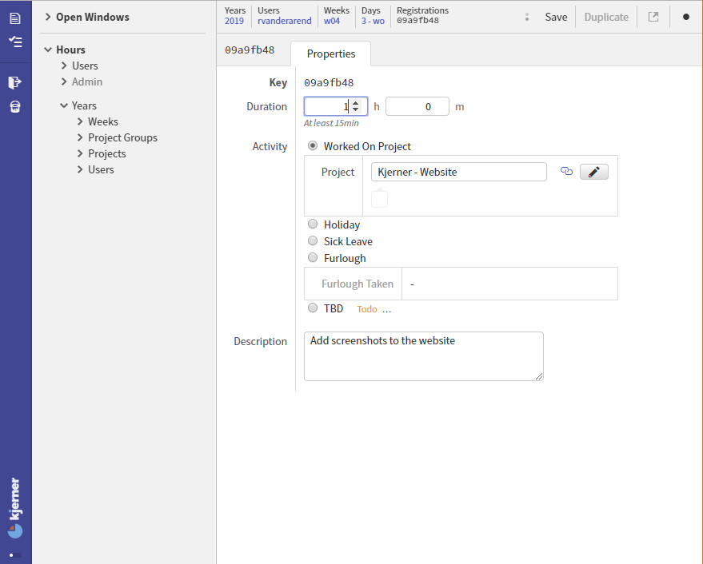

## The ERP system built for scale-ups

We offer a unique ERP system, capable of fully supporting scale-ups during their way up.

As a business aiming to scale up, getting your core business processes fully supported by software is essential.
If you scale up without this, you will make your business unmanageable - which is very hard to revert.

With a solution using our ERP product, you will have the possibility to:
* Start without a high investment and without high subscription fees
* Have it adapted to your needs and extended to support your unique business processes
* And still be sure to receive the latest technical and functional updates, keeping your system up-to-date

Get all of your business processes, including finances, projects and products, sales, inventory and purchases fully supported, so you can focus on improving your business. Have us demonstrate you how we do that by contacting us at erpnext@kjerner.com

